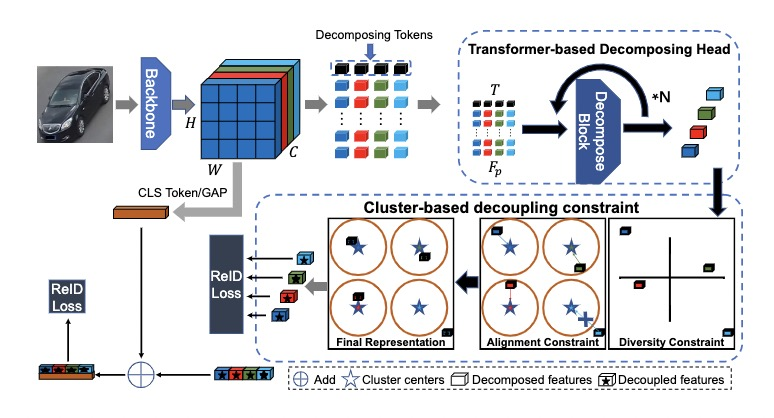

# [ECCV2022] Unstructured Feature Decoupling for Vehicle Re-Identification (UFDN)
Unstructured Feature Decoupling for Vehicle Re-Identification [pdf](https://drive.google.com/file/d/1pKWv4r6pwGG5snFM2r4AWyXJ7bjTyl8a/view?usp=sharing)

## News
- 2022.7  We release the code of UFDN.

## Pipeline




## Requirements

### Installation

```bash
pip install -r requirements.txt
(we use /torch 1.7.1 /torchvision 0.8.2 /timm 0.3.2 /cuda 11.0 / 16G or 32G V100 for training and evaluation.)
```

### Prepare Datasets

```bash
mkdir data
```

Download the vehicle datasets [VehicleID](https://www.pkuml.org/resources/pku-vehicleid.html), [VeRi-776](https://github.com/JDAI-CV/VeRidataset), [VERIWILD](https://github.com/PKU-IMRE/VERI-Wild).
Then unzip them and rename them under the directory like

```
data
└── VeRi
    └── images ..
└── VehicleID
    └── images ..
└── VERI-WILD
    └── images ..

```

### Prepare Res50 or Swin Pre-trained Models

You need to download the ImageNet pretrained transformer model : [Res50](https://download.pytorch.org/models/resnet50-19c8e357.pth), [Swin-tiny](https://github.com/SwinTransformer/storage/releases/download/v1.0.0/swin_tiny_patch4_window7_224.pth).

## Training

We utilize 1  GPU for training VeRi-776 Dataset

```
sh experiments/train_res50_UFDN_776.sh or train_swin_UFDN_776.sh

```

We utilize 1  GPU for training VehicleID Dataset

```
sh experiments/train_res50_UFDN_VehicleID.sh or train_swin_UFDN_VehicleID.sh

```


## Trained Models and logs

We have reproduced the performance to verify the reproducibility. The reproduced results may have a gap of about 0.1-0.2% with the numbers in the paper.

##### Experiments
|method|backbone|dataset|Result |log |model|
|:------:|:------:|:------:|:------:|:------:|:------:|
|UFDN  |Res50   |VeRi-776|81.5%/96.5%|[log](https://drive.google.com/file/d/1ynAq-Rm4_yBs2wNXSM1DxkMxgbPvB3xu/view?usp=sharing)|[model](https://drive.google.com/file/d/1iL0l4VjMwc36XDsgCAuZFdlfQpEW4sej/view?usp=sharing)|
|UFDN|Swin-tiny|VeRi-776|80.8%/96.5%|[log](https://drive.google.com/file/d/13aINxij07svV-Vd9w0j2TbVBXhbkm_qE/view?usp=sharing)|[model](https://drive.google.com/file/d/1XBN3E8RLHMDFPu2FRK4VlfTKb-TexjKU/view?usp=sharing)|


## Acknowledgement

Codebase from [reid-strong-baseline](https://github.com/michuanhaohao/reid-strong-baseline) , [pytorch-image-models](https://github.com/rwightman/pytorch-image-models), [TransReID](https://github.com/damo-cv/TransReID)


## Contact

If you have any question, please feel free to contact us. E-mail: [qianwen2018@ia.ac.cn](qianwen2018@ia.ac.cn) , [haoluocsc@zju.edu.cn](mailto:haoluocsc@zju.edu.cn)


## Citation

If you find this code useful for your research, please cite our paper

```
@InProceedings{Qian_2022_ECCV,
    author    = {Qian, Wen and Luo, Hao and Peng, Silong and Wang, Fan and Chen, Chen and Li, Hao},
    title     = {Unstructured Feature Decoupling for Vehicle Re-Identification},
    booktitle = { European Conference on Computer Vision (ECCV)},
    month     = {October},
    year      = {2022},
}
```
